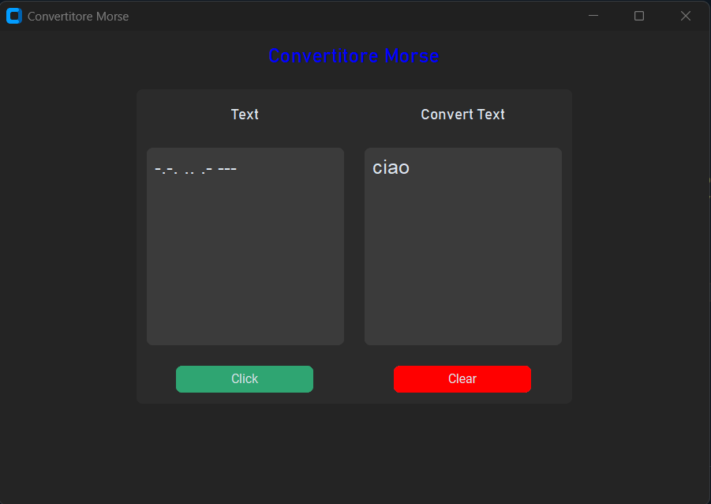

# Convertittore di codice Morse
Molto semplicemente questo programma permette di convertire una frase o parola in codece morse o viceversa. 

Nel campo _text_ si puo inserire codice morse che verra convertito in caratteri normali o testo che vera convertito in morse.

## Librerie

Lunica libreria facoltativa e __customtkinter__ 

    pip install customtkinter
